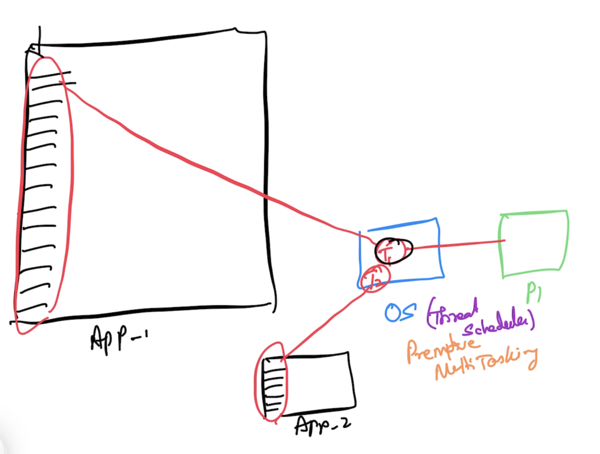
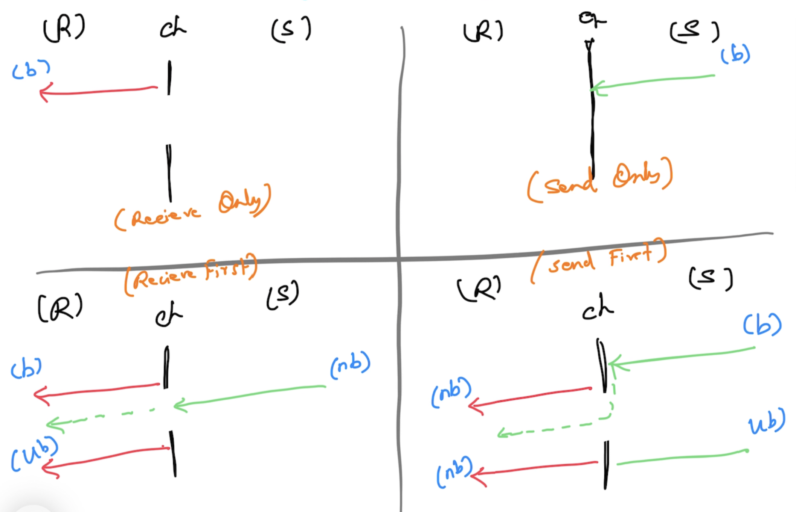

# Advanced Go

## Magesh Kuppan
- tkmagesh77@gmail.com

## Schedule
- Commence      : 09:00 AM
- Tea Break     : 10:30 AM (20 mins)
- Lunch Break   : 12:30 PM (1 hr)
- Tea Break     : 03:00 PM (20 mins)
- Wind up       : 05:00 PM

## Methodology
- No powerpoint presentation
- Discuss & Code
- No dedicated time for Q&A

## Repository
- https://github.com/tkmagesh/cisco-advgo-jul-2024

## Prerequisites
- Programming Constructs
- Higher Order Functions
- Error Handling
- Panic & Recovery
- Structs & Methods
- Struct Composition
- Interfaces
- Modules & Packages
- Concurrency (Optional)

## Software Requirements
- Go tools
- Any editor (Visual Studio Code)
- Docker Desktop (Optional)

## Review
- Higher Order Functions
- Interfaces
- Struct Composition
- Deferred Functions
- Panic & Recovery

### Higher Order Functions
- Assign functions to variables
- Pass functions as arguments
- Return a function as a return value

## Concurrency
- Ability to have more than one execution path
- Typically achieved using OS Threads
    - OS Threads are costly
        - ~2 MB of Memory (in linux)
        - Mitigate the cost of creating/destroying threads using thread pools


### Go Concurrency
- Concurrent operations are represented as "goroutines"
- goroutines are cheap (~4KB)
- Builtin scheduler
    - Go scheduler schedules the goroutine executions through the OS threads
- Concurrency support is built in the language itself
    - go keyword, channel data type, channel operator ( <- ), for-range, select-case
    - APIs support
        - "sync" package
        - "sync/atomic" package


### WaitGroup ("sync" package)
- semaphore based counter
- has the capability to block the execution of the current function until the counter becomes 0

### Data Race
```
go run --race [filename.go]
```
```
go build --race [filename.go]
```

### Channels
#### Declaration
```go
var [var_name] chan [data_type]
// ex:
var ch chan int
```
#### Instantiation
```go
[var_name] = make(chan [data_type])
// ex:
ch = make(chan int)
```
#### Combine Declaration & Instantiation
```go
ch := make(chan int)
```
#### Channel Operations
- using the channel operator ( <- )
##### Send Operation
```go
[channel_var_name] <- [data]
// ex:
ch <- 100
```
##### Receive Operation
```go
<-[channel_var_name]
// ex:
data := <-ch
```

##### Channel Behavior
- "Receive" operation is ALWAYS a blocking operation
- A "Send" operation is blocked until a "Receive" operation a initiated (conditional)

### Context
- API for "cancellation" propagation
- context.Background() (used to create the top-most context and this is non-cancellable)
- Context creation apis
    - context.WithCancel()
        - programmatic cancellation
    - context.WithTimeout()
        - Will automatically do cancellation based on the elapsed time
        - Wrapper for context.WithDeadline()
    - context.WithDeadline()
        - Will automatically do cancellation based on the absolute date & time
    - context.WithValue()
        - Used to share data through context hierarchy
        - Does not offer cancellation functionality
## HTTP Service
### net/http package
- Both http client & server apis
### Routing Libraries
### Web Frameworks

## GRPC
- Alternative to HTTP based restful services
- Optimal for micro-services communication
- Communication Patterns
    - Request & Response
    - Server Streaming (one request & stream of responses)
    - Client Streaming (stream of requests & one response)
    - Bidirectional Streaming (stream of requests & stream of responses)
- Use HTTP2
- Uses Protocol Buffers for serializing payloads
    - [Protocol Buffers Reference](https://protobuf.dev/)
    - Share the schema among the consumers and producers in advance
- Multi-language supports
    - Go
    - Java
    - .NET
    - Node.js
    - Python
### Steps
- Create "Service / Operation / Data" contracts using protocol buffers
- Share the schema between the server & client
- Generate the proxy & stub using the schema
    client -> proxy -> stub -> service
- Implement & Host the server
- Use the proxy to communicate to the server

### Tools Installation 
    1. Protocol Buffers Compiler (protoc tool)
        Windows:
            Download the file, extract and keep in a folder (PATH) accessble through the command line
            https://github.com/protocolbuffers/protobuf/releases/download/v24.4/protoc-24.4-win64.zip
        Mac:
            brew install protobuf

        Verification:
            protoc --version

    2. Go plugins (installed in the GOPATH/bin folder)
        go install google.golang.org/protobuf/cmd/protoc-gen-go@v1.28
        go install google.golang.org/grpc/cmd/protoc-gen-go-grpc@v1.2

## Testing
- gotest - https://github.com/rakyll/gotest
- mockery - https://vektra.github.io/mockery/latest/
- testify - https://github.com/stretchr/testify
